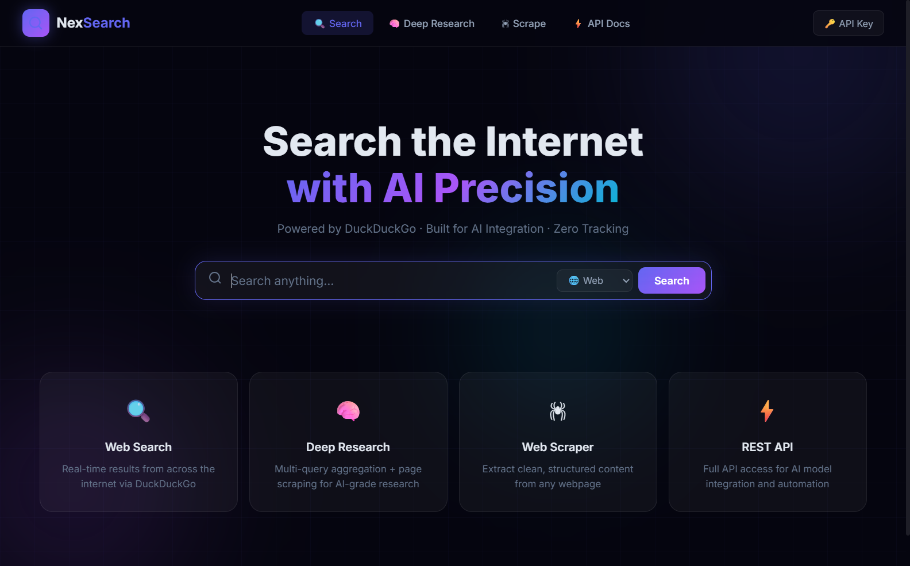

# 🔍 NexSearch — AI-Powered Search Engine API

A full-stack search engine web app with a powerful REST API designed for **AI model integration** and **deep internet research**.



## ✨ Features

| Feature | Description |
|---|---|
| 🌐 **Web Search** | Real-time results via Bing scraping |
| 📰 **News Search** | Latest news results |
| ⚡ **Instant Answer** | Facts, definitions, summaries via DuckDuckGo |
| 🕷 **Web Scraper** | Extract clean content from any URL |
| 🧠 **Deep Research** | Multi-query search + page scraping → AI-ready context |
| 🔑 **API Key Auth** | Secure all endpoints with API key |
| 📦 **Response Cache** | 5-min in-memory cache for faster responses |
| 🚦 **Rate Limiting** | 100 req/min per IP |

---

## 🚀 Quick Start

### 1. Install Dependencies
```bash
npm install
```

### 2. Configure Environment
Edit `.env`:
```env
PORT=3000
API_KEY=your-secret-key-here
```

### 3. Start Server
```bash
npm start        # Production
npm run dev      # Development (auto-reload)
```

### 4. Open Web UI
```
http://localhost:3000
```

---

## 🔌 API Reference

All endpoints require authentication via:
- Header: `X-Api-Key: YOUR_KEY`
- Query: `?api_key=YOUR_KEY`

### 🌐 Web Search
```http
GET /api/search?q=quantum+computing
```
| Param | Type | Default | Description |
|---|---|---|---|
| `q` | string | required | Search query |
| `page` | number | 1 | Result page |
| `region` | string | wt-wt | Region code |

**Response:**
```json
{
  "success": true,
  "data": {
    "query": "quantum computing",
    "results": [
      {
        "title": "Quantum computing - Wikipedia",
        "url": "https://en.wikipedia.org/wiki/Quantum_computing",
        "domain": "en.wikipedia.org",
        "snippet": "A quantum computer is a real or theoretical computer..."
      }
    ],
    "instantAnswer": { "abstract": "...", "abstractUrl": "..." },
    "page": 1,
    "engine": "bing"
  }
}
```

---

### 📰 News Search
```http
GET /api/search/news?q=AI+technology
```

---

### ⚡ Instant Answer
```http
GET /api/search/instant?q=Albert+Einstein
```

---

### 🕷 Scrape URL
```http
POST /api/scrape
Content-Type: application/json

{
  "url": "https://en.wikipedia.org/wiki/Artificial_intelligence",
  "maxLength": 5000
}
```

**Response includes:** `title`, `content`, `headings`, `paragraphs`, `links`, `wordCount`

---

### 🕷 Batch Scrape
```http
POST /api/scrape/batch

{
  "urls": ["https://site1.com", "https://site2.com"],
  "maxLength": 3000,
  "concurrency": 3
}
```

---

### 🧠 Deep Research (AI Integration)
```http
POST /api/research
Content-Type: application/json

{
  "topic": "What is quantum computing and how does it work?",
  "maxResults": 10,
  "maxScrape": 5,
  "scrapeContent": true,
  "region": "wt-wt"
}
```

**Response includes:**
- `searchResults` — Top ranked results
- `scrapedPages` — Full content of top pages
- `aiContext` — **Pre-formatted text for AI consumption**
- `instantAnswer` — Quick facts/summaries
- `stats` — Timing, counts

---

## 🤖 AI Model Integration

### OpenAI / ChatGPT
```javascript
const response = await fetch('http://localhost:3000/api/research', {
  method: 'POST',
  headers: {
    'Content-Type': 'application/json',
    'X-Api-Key': 'YOUR_KEY'
  },
  body: JSON.stringify({
    topic: 'Latest breakthroughs in fusion energy 2025',
    maxResults: 15,
    maxScrape: 5,
    scrapeContent: true
  })
});

const { data } = await response.json();

// Feed the AI context directly to your model
const aiResponse = await openai.chat.completions.create({
  model: 'gpt-4o',
  messages: [
    { role: 'system', content: 'You are a research assistant. Analyze the provided research context and give comprehensive insights.' },
    { role: 'user', content: data.aiContext },  // ← Full research context
    { role: 'user', content: 'Please summarize the key findings and insights.' }
  ]
});
```

### Python (Anthropic Claude, Gemini, etc.)
```python
import requests

# Step 1: Deep Research
res = requests.post('http://localhost:3000/api/research',
  headers={'X-Api-Key': 'YOUR_KEY', 'Content-Type': 'application/json'},
  json={
    'topic': 'renewable energy innovations 2025',
    'maxResults': 10,
    'maxScrape': 5
  }
)
data = res.json()['data']

# Step 2: Feed to Claude
import anthropic
client = anthropic.Anthropic()

message = client.messages.create(
  model="claude-opus-4-5",
  max_tokens=2048,
  messages=[{
    "role": "user",
    "content": f"{data['aiContext']}\n\nBased on this research, what are the top 5 most promising innovations?"
  }]
)
print(message.content[0].text)
```

---

## 📁 Project Structure

```
Search-Engine-API/
├── server.js                  # Express server entry point
├── .env                       # Environment config
├── src/
│   ├── services/
│   │   ├── duckduckgo.js      # Bing search + DDG instant answers
│   │   ├── scraper.js         # Web content extractor (Cheerio)
│   │   └── research.js        # Deep research orchestrator
│   ├── routes/
│   │   ├── search.js          # Search endpoints
│   │   ├── scrape.js          # Scrape endpoints
│   │   └── research.js        # Research endpoints
│   ├── middleware/
│   │   ├── auth.js            # API key authentication
│   │   └── cache.js           # In-memory response cache
│   └── utils/
│       └── helpers.js         # Utility functions
└── public/
    ├── index.html             # Web UI
    ├── css/style.css          # Dark glassmorphism design
    └── js/app.js              # Frontend JavaScript
```

---

## ⚙️ Environment Variables

| Variable | Default | Description |
|---|---|---|
| `PORT` | 3000 | Server port |
| `API_KEY` | required | Secret API key |
| `RATE_LIMIT_MAX` | 100 | Max requests per window |
| `RATE_LIMIT_WINDOW_MS` | 60000 | Rate limit window (ms) |
| `MAX_SCRAPE_PAGES` | 5 | Max pages to scrape per research |
| `SCRAPE_TIMEOUT_MS` | 10000 | Scrape timeout per page |

---

## 🛡️ Security

- All API endpoints are protected by API key
- Rate limiting (100 req/min default)
- Helmet.js security headers
- CORS configured
- No external API keys required (uses web scraping)

---

## 📝 License

MIT License — Free to use and modify.

---

Made with ❤️ by **Irnhakim**
